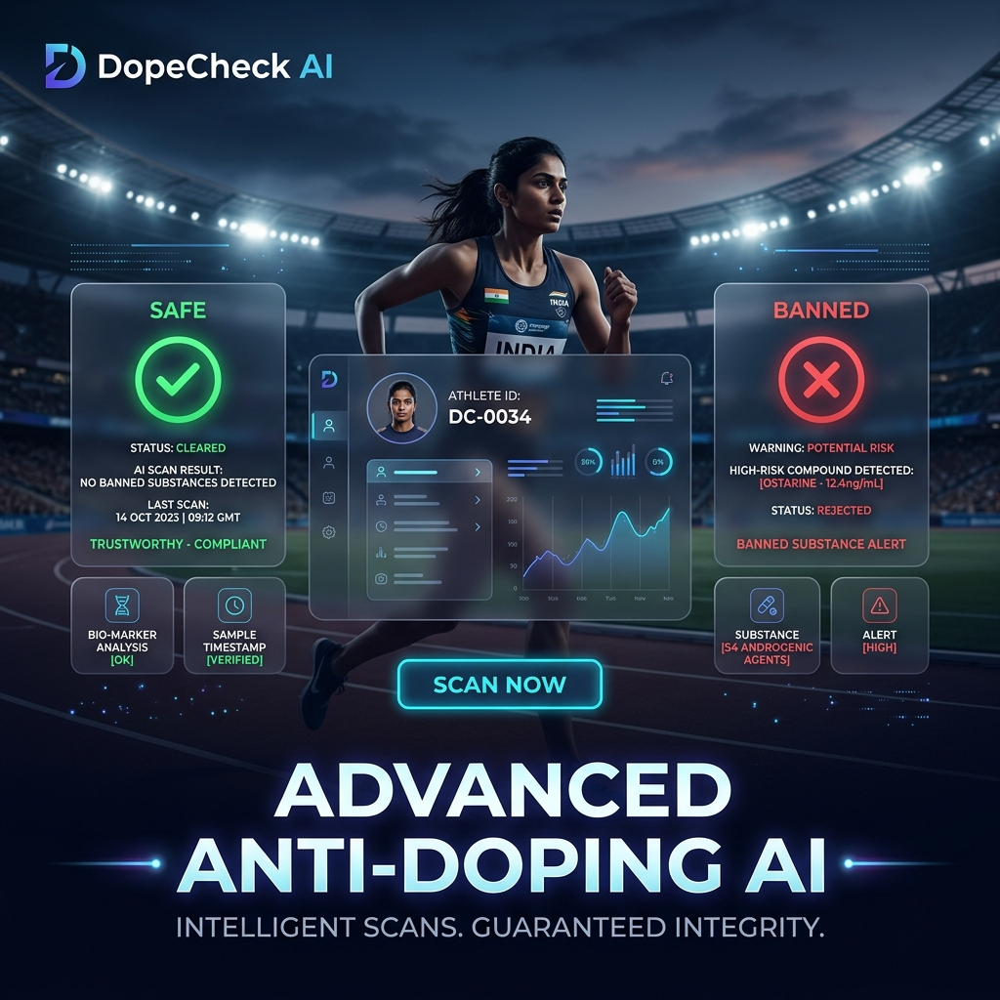
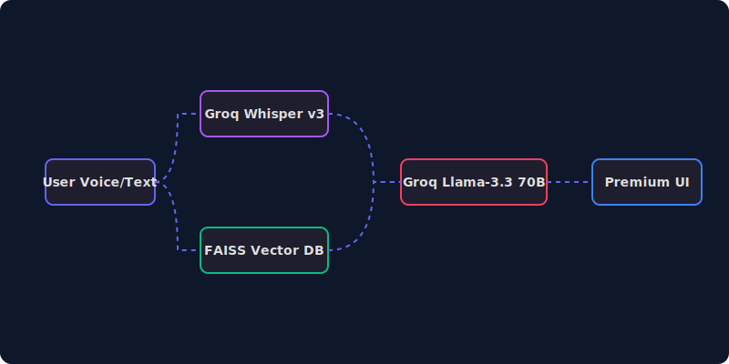

# 🛡️ V-Shield AI: Vernacular Anti-Doping Assistant



[](https://github.com/yakoob-md/antidoping-assistant)
[](https://fastapi.tiangolo.com/)
[](https://tailwindcss.com/)
[](https://groq.com/)

> **"The ultimate safety companion for the modern road athlete."**
> V-Shield AI is a production-grade, voice-first RAG (Retrieval-Augmented Generation) assistant designed to protect rural and professional Indian athletes from unintentional doping through instant, vernacular advice.

---

## ✨ The "Wow" Factor: Premium Excellence

V-Shield isn't just a chatbot; it's a high-end digital mentor. Our latest update introduces a **Premium Midnight-Glass** interface designed to wow users at first glance.

### 🌌 Midnight-Glass Design System
- **Vibrant Animated Backgrounds**: Flowing indigo and cyan "aurora" undulations that react and move, creating a living, breathing application surface.
- **Next-Gen Glassmorphism**: High-depth `backdrop-blur-3xl` panels with ultra-thin glowing borders and shadow-bloom effects.
- **Hardware Accelerated**: Optimized with `will-change` properties and GPU-offloaded transitions for a buttery-smooth 60FPS experience even on mobile devices.

### 🎙️ Instant Vernacular Narration
- **Sub-Millisecond Delivery**: Integrated backend `lru_cache` ensures that repeated audio requests are served instantly from memory.
- **Natural Hinglish Accent**: Specialized TTS pipeline that detects mixed Hindi-English and uses a natural Indian accent (`hi-IN`) for maximum cultural resonance and clarity.

---

## 🚀 Core Intelligence Features

*   **🛡️ V-Shield Protocol**: Every response is grounded in a verified knowledge context derived from WADA Prohibited Lists and Indian pharmaceutical data.
*   **🗣️ Natural Hinglish Understanding**: Seamlessly switch between English and Romanized Hindi. The AI understands *"Kya ye supplement safe hai?"* as easily as *"Tell me about Creatine."*
*   **🧠 Context-Aware Memory**: Remembers your previous questions. Ask about "Vicks Action 500" and then follow up with "Is it banned?"—the AI knows exactly what you mean.
*   **📉 Deterministic Risk Tagging**: Every answer starts with a clear, color-coded status: **SAFE ✅**, **CAUTION ⚠️**, **BANNED ❌**, or **UNKNOWN ❓**.

---

## 🏗️ System Architecture



V-Shield leverages a cutting-edge **Multilingual RAG Pipeline** powered by Groq's LPU (Language Processing Unit) for near-instant inference:

1.  **Voice/Text Ingestion**: Whisper-v3 handles multilingual STT with high accuracy.
2.  **Vector Retrieval**: FAISS index searches across thousands of WADA-certified data chunks using `paraphrase-multilingual-MiniLM-L12-v2`.
3.  **Neural Reasoning**: Llama-3.3 70B synthesizes the retrieved facts into a concise 3-sentence logic.
4.  **Deterministic Output**: A specialized parser ensures the risk tag matches the scientific evidence.

---

## 📁 Project Overview

```text
anti-doping-app/
├── main.py              # FastAPI Backend (RAG + Cache + Session Management)
├── build_vector_db.py   # FAISS Vector Index Generator
├── hero_banner.png      # Premium Branding Asset
├── architecture_animated.svg # Interactive Architecture Visualization
├── frontend/            # Vite + React + Tailwind (Midnight-Glass UI)
│   ├── src/App.tsx      # Core V-Shield UI Logic
│   └── src/index.css    # Premium Design Tokens & Utilities
├── faiss_index.bin      # High-performance Vector Storage
└── chats_v2.db          # Persistent SQLite Session Memory
```

---

## 🛠️ Getting Started

### 1. Requirements
- Python 3.9+ & Node.js 18+
- [Groq API Key](https://console.groq.com) (FREE)

### 2. Rapid Setup
```bash
# 1. Setup Backend
pip install -r requirements.txt
python build_vector_db.py  # Create the brain

# 2. Setup Frontend
cd frontend
npm install

# 3. Launch (Terminal 1)
uvicorn main:app --reload

# 4. Launch (Terminal 2)
npm run dev
```

---

## 🔍 Why it Matters
Rural athletes often lack access to professional sports doctors. **V-Shield AI** fills this gap by translating complex WADA regulations into simple, vernacular, and actionable advice delivered through a state-of-the-art interface that respects the athlete's focus and passion.

---

### 🌟 Standards Applied
- **WADA Code 2024 Compliance**
- **NADA Localized Medicine Database**
- **CoE-NSTS Supplement Verification**

---
Produced with ❤️ by **Yakub**. Built for the gold.
