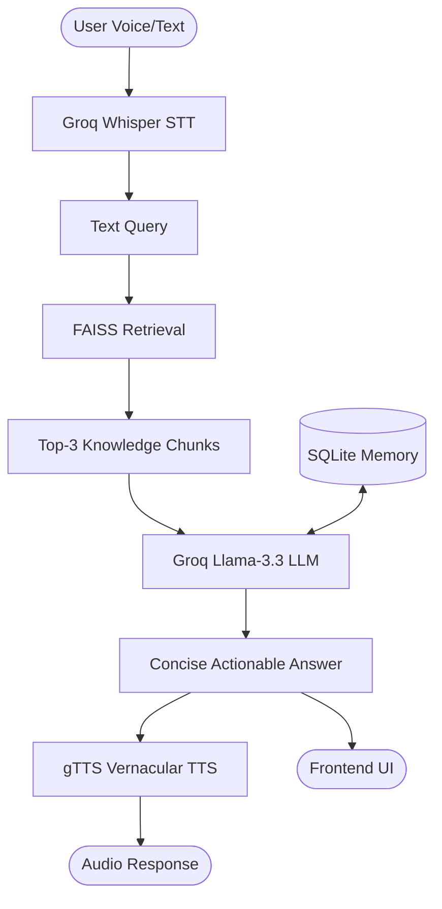

# 🏅 Clean Sport – Vernacular Voice-First Anti-Doping RAG App

A production-grade, voice-first RAG assistant for rural Indian athletes. This app answers safety queries about medicines and supplements in **Hinglish**, pulling from a specialized knowledge base of WADA prohibited substances and Indian medical data.

---

## 🚀 Key Features

- **Voice-First Interaction**: Uses Groq-powered Whisper for STT and gTTS for vernacular audio responses.
- **RAG-Enhanced Brain**: FAISS vector database ensures responses are grounded in official anti-doping facts.
- **Hinglish Support**: Naturally understands and responds in Romanized Hindi/Hinglish for rural accessibility.
- **Persistent Memory**: SQLite-based chat history to track entire conversation contexts.
- **Localized Knowledge**: Built-in data on common Indian branded medicines and CoE-NSTS certified supplements.

---

## 📁 Project Structure

```text
anti-doping-app/
├── main.py              # FastAPI Backend (RAG Pipeline + SQLite session management)
├── build_vector_db.py   # Vector Database Generator (Run once)
├── requirements.txt     # Python Dependencies
├── .env                 # Environment variables (Groq Key)
├── frontend/            # Modern React + Vite + Tailwind Frontend
│   ├── src/             # Frontend source code
│   ├── package.json     # Node dependencies
│   └── vite.config.ts   # Vite configuration
├── faiss_index.bin      # Generated Vector Index (Created by build script)
├── chunks.pkl           # Text chunks (Created by build script)
└── chats_v2.db          # SQLite persistent chat history
```

---

## 🛠️ Installation & Setup

### 1. Prerequisites
- **Python 3.9+**
- **Node.js 18+**
- **Groq API Key**: Get one free at [console.groq.com](https://console.groq.com)

### 2. Backend Setup
Activate a virtual environment and install dependencies:
```bash
# Create and activate virtual environment
python -m venv doping_venv
# Windows:
doping_venv\Scripts\activate
# MacOS/Linux:
source doping_venv/bin/activate

# Install dependencies
pip install -r requirements.txt
```

### 3. Environment Variables
Create a `.env` file in the root directory:
```env
GROQ_API_KEY="your_groq_api_key_here"
```

### 4. Build the Vector Database (Run ONCE)
Bootstrap the RAG system with the localized dataset:
```bash
python build_vector_db.py
```
This generates `faiss_index.bin` and `chunks.pkl`.

### 5. Frontend Setup
Install Node dependencies:
```bash
cd frontend
npm install
```

---

## ⚡ Running the Application

You need two terminals running—one for the backend and one for the frontend.

### Terminal 1: Backend
```bash
# Ensure venv is active
uvicorn main:app --reload --port 8000
```
Backend will be available at `http://localhost:8000`.

### Terminal 2: Frontend
```bash
cd frontend
npm run dev
```
Frontend will be available at `http://localhost:5173`.

---

## 🧠 System Architecture



---

## 📊 Dataset Coverage

- **52+ WADA Prohibited Substances**: Specific ban status and agricultural contamination notes (Clenbuterol, etc.).
- **15+ Common Indian Medicines**: Brand-name lookups (Vicks Action 500, Corex, PAN-40).
- **16+ Indian Supplements**: Detailed risk profiles for Ayurvedic & protein products (Ashwagandha, Shilajit, MuscleBlaze).
- **Educational Modules**: Strict Liability, TUE Process, and Rural Doctor awareness.

---

## 🔒 Safety Design Principles

1. **Safety First**: Any unknown substance is tagged **UNKNOWN ❓** and treated with caution.
2. **Deterministic Structure**: Every AI response follows a strict 3-sentence format (Risk Tag, Fact, Advice).
3. **Romanized Output**: LLM is constrained to Latin script to ensure readability on all devices.
4. **No Hallucinations**: Strict instructions to use *only* provided RAG context or state ignorance.

